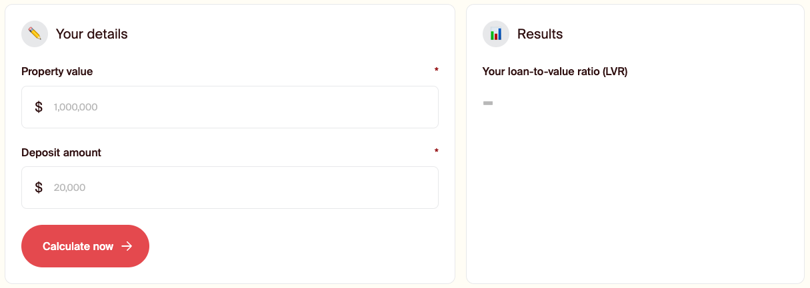
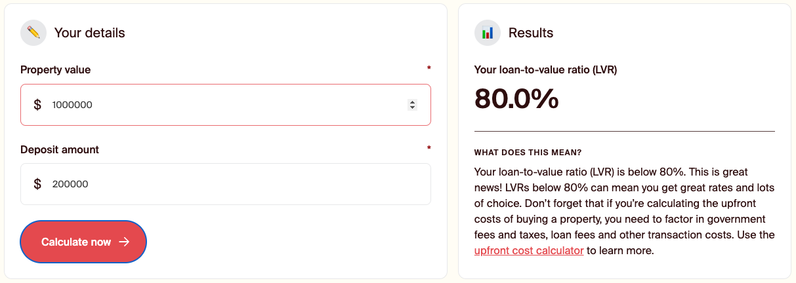
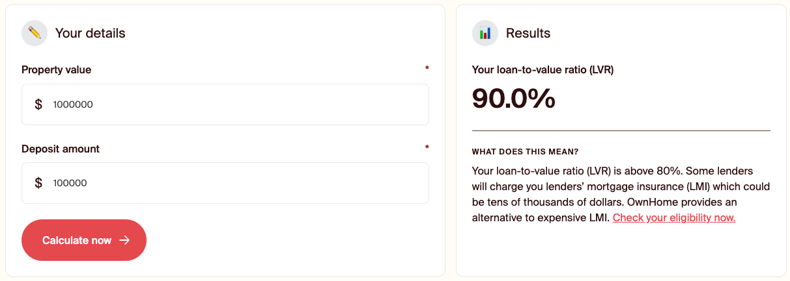

# OwnHome Front-end Engineer Take Home Case Study

 **DO NOT FORK THIS REPOSITORY IN GITHUB, CLONE IT AND FOLLOW THE INSTRUCTIONS FOR SUBMISSION AT THE END OF THE README**

Hi, thanks for completing the front-end engineer case study

The purpose of this exercise is for us to get a sense of your skill level with CSS, JavaScript, and React. While also getting a sense of your approach to solving problems.

The problem we've chosen is an LVR calculator, similar to what exists on banks websites.

## The Brief

This project is a small public facing calculator to allow users to understand their LVR (Loan-to-Value Ratio). It requires a very simple formula for the calculation. 

### Create a form with the following inputs:
- Estimated property value (minimum $100,000 & maximum $3,000,000)
- Estimated deposit amount

### Write a function that calculates and displays the LVR based on the inputs
- `(propertyValue - depositAmount)/propertyValue`
- Dynamically show an explainer text based on the output value.
   - Where the results is `>80%` show the applicable text
   - When the results is `<=80%` show the applicable text

### Considerations
- It's up to you to define the data structures
- Style the application as per the designs provided below
- Responsive behaviour of the layout and respond or adadpt elements down to a screen width of 320px.
- Validate the form input with min/max ranges.
- Add unit tests for loan calculation
- Integration tests for validation
- If are making any assumptions along the way, please take notes and make sure of comments so you can walk us through later.
- Feel free to use any additional packages you think will help. Of course, the goal here is to show us clean, readable code (we want to see that you can write maintainable code)

## Getting Started
This application has been bootstrapped with [create-react-app](https://create-react-app.dev/docs/getting-started/).

## Submitting your work

When you have completed the exercise and wish to submit your work, please do the following:

1. Make sure all your work is commited to your branch, good commit messages and telling a story
   through the commits is a good thing.
2. Zip up the folder containing your repo and send to either your recruitment contact or mitch@ownhome.com.

**DO NOT PUSH THE REPO UP TO GITHUB OR CREATE A PULL REQUEST AGAINST THIS REPO.**

---

### Designs
See the images below of the designs. Fonts and colour have already been provided to you in this repo.

